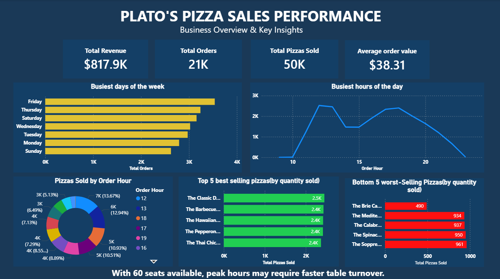
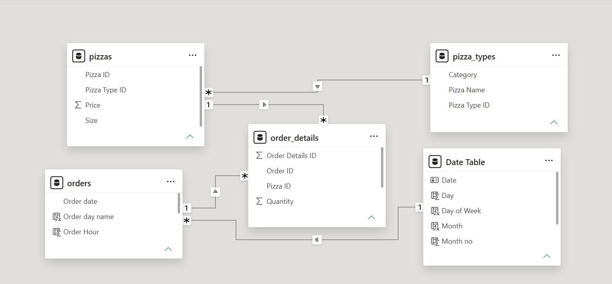

# Plato's Pizza Sales & Operations Performance Dashboard

## Project Overview
Before building the dashboard, the primary goal was simple: Mario, the owner of Plato's Pizza Restaurant, wanted to understand overall business performance, identify when customers buy the most, and determine which pizza products drive sales.

This project transforms historical transactional order logs into a structured Power BI dashboard. It delivers actionable business intelligence to guide staff scheduling, manage kitchen capacity, and optimize menu engineering.

## Dashboard Preview


---

## Skills Demonstrated
* **Data Preparation & ETL:** Cleaned and preprocessed transactional records in Microsoft Excel before refining transformations in Power Query Editor.
* **Data Modeling:** Built a 1-to-Many Star Schema model connecting fact table records with dimension lookup tables.
* **DAX Calculations:** Developed key performance measures using `SUM`, `SUMX`, `RELATED`, `DIVIDE`, and `DISTINCTCOUNT`.
* **Data Visualization & Business Storytelling:** Designed a structured executive layout in dark blue featuring KPI cards, horizontal bar charts, line graphs, and donut charts to analyze order traffic and hourly production volume.

---

## Tools Used
* **Microsoft Excel:** Initial data inspection, early cleaning, and dataset structuring.
* **Power Query Editor (Power BI):** Data cleaning, handling missing values, removing invalid records, validating data types, and creating custom time-based columns (day of week, hour of day).
* **Power BI Desktop:** Data modeling, DAX measure development, dynamic visual report building, and dashboard layout design.
* **GitHub:** Version control and technical portfolio documentation.

---

## Business Problem & Context
Plato's Pizza operates with **15 tables providing a total seating capacity of 60 seats**. While the dataset does not directly track dine-in seating, high order volumes during rush periods suggest seating capacity comes under severe pressure. Management lacked clear visibility into peak operational hours and product demand needed to balance kitchen throughput, table turnover, and menu management.

---

## Business Objectives
* Track core business health metrics: Total Revenue, Total Orders, Total Pizzas Sold, and Average Order Value.
* Identify demand patterns across days of the week and hours of the day to optimize shift planning.
* Analyze kitchen output by calculating the volume of pizzas produced during peak operational hours.
* Pinpoint the top 5 best-selling pizzas driving revenue and bottom 5 worst-selling pizzas to guide menu adjustments.
* Evaluate estimated seating capacity pressure during peak customer periods.

---

## Data Architecture & Modeling
The report is powered by a **Star Schema** data model, connecting four datasets (`orders`, `order_details`, `pizzas`, and `pizza_types`) via 1-to-many (`1:*`) single-direction relationships:



* **Fact Table:** `order_details` (`Order Details ID`, `Order ID`, `Pizza ID`, `Quantity`)
* **Dimension Tables:**
  * `orders` (`Order ID`, `Order date`, `Order day name`, `Order Hour`)
  * `pizzas` (`Pizza ID`, `Pizza Type ID`, `Price`, `Size`)
  * `pizza_types` (`Pizza Type ID`, `Pizza Name`, `Category`)
  * `Date Table` (`Date`, `Day`, `Day of Week`, `Month`, `Month no`, `Quarter`, `Year`)

---

## Key DAX Measures

```dax
// Total Volume of Pizzas Sold
Total Pizzas Sold = SUM(order_details[Quantity])

// Total Sales Revenue
Total Revenue = SUMX(order_details, order_details[Quantity] * RELATED(pizzas[Price]))

// Total Unique Orders
Total Orders = DISTINCTCOUNT(orders[Order ID])

// Average Order Value
Average order value = DIVIDE([Total Revenue], [Total Orders])
